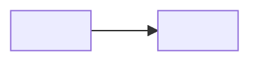

## Summary

<!-- What does this PR change, and which task does it serve? -->
- Task: <!-- task1 / task2 / task3 / common -->
- 

## Why

<!-- The motivation or the failing test/eval that prompted this change. -->

## Before / After Diagram

<!--
Draw a diagram showing what this PR introduces. Show the state BEFORE the change
and the state AFTER the change so a reviewer can see the delta at a glance.

Use a Mermaid block (rendered by GitHub) or ASCII art. Examples:
- New flow / sequence: `sequenceDiagram` before vs. after.
- New module / boundary: `flowchart LR` with the new node highlighted.
- Schema / data shape change: two `classDiagram` or two fenced JSON blocks.

Keep it small — the goal is "what changed", not full architecture.
-->

## TDD checklist

- [ ] A failing test (or eval case) was written first and committed before the implementation
- [ ] All tests pass locally (`uv run pytest`)
- [ ] `uv run ruff check .` is clean
- [ ] `uv run ruff format --check .` is clean
- [ ] No production code added beyond what the failing test demanded

## OpenSpec

<!-- If this PR is part of an OpenSpec change, link the change folder. -->
- Change: `openspec/changes/<change-name>/`

## Notes for reviewer

<!-- Anything non-obvious: design trade-offs, follow-ups, deferred work. -->
