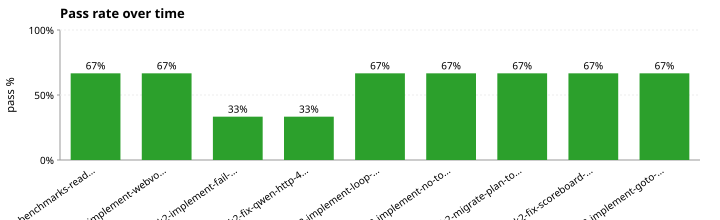
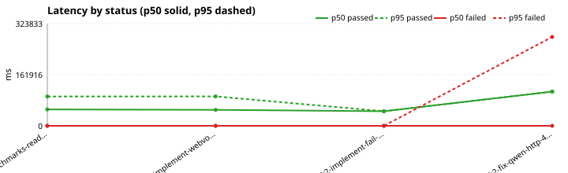
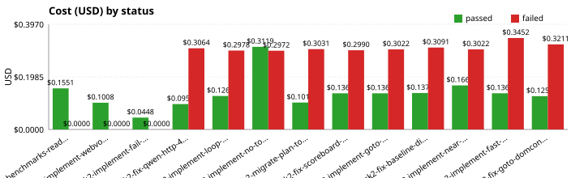
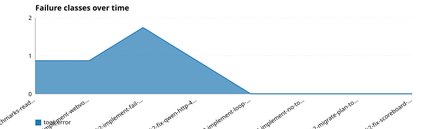
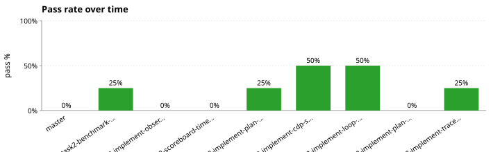
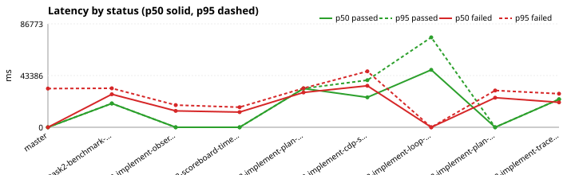
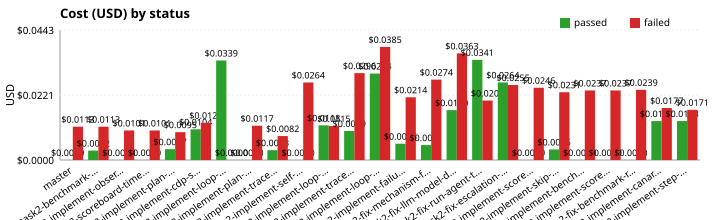
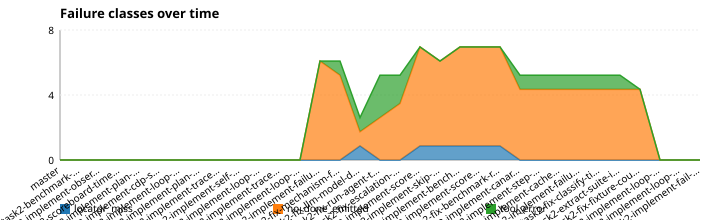

# Task 2 — Generalized Browser Automation Agent

## Benchmarks

The per-PR benchmark is **WebVoyager** — a curated subset of real-world web-navigation tasks from [WebVoyager](https://arxiv.org/abs/2401.13919) (He et al., 2024, CC BY 4.0). Each `/done_pr` run records a fresh WebVoyager run for the branch under `benchmark/<branch>/webvoyager/<timestamp>.json`. The earlier fixture-backed *basic benchmark* (locate ladder, cache invalidation, supervisor halt/replan) is **archived** below — its prior trend charts and the most recent run are preserved for context but the suite is no longer executed per PR.

### WebVoyager benchmark (live web)

WebVoyager tasks are real-world web-navigation prompts (e.g. "Navigate to wikipedia.org and find the 2018 Turing Award winners"). The vendored subset under `eval/bench/data/webvoyager/` is biased toward sites that are stable, popup-free, and load fast (Wikipedia, arXiv, GitHub, HuggingFace, BBC News, Cambridge Dictionary, Wolfram Alpha) so the suite stays cheap enough to run on every branch. Sites known to gate behind login, captcha, or aggressive bot detection (Booking, Flights, Amazon, Allrecipes, Apple, Coursera) are deliberately excluded.

Run the live suite from `task2/`:

```bash
BRANCH="$(git rev-parse --abbrev-ref HEAD)"
SAFE_BRANCH="${BRANCH//\//-}"
EVAL_RESULTS_DIR="benchmark/${SAFE_BRANCH}/webvoyager" \
  LLM_BASE_URL=http://localhost:8090 LLM_MODEL=qwen3.5-27b \
  uv run python -m scripts.bench --suite webvoyager --live
```

Artifacts land at `task2/benchmark/<sanitized-branch>/webvoyager/<timestamp>.json` in the same `cases[]` shape as `benchmark/task2-benchmarks-readme-and-tier0/webvoyager/baseline.json`.

<!-- WEBVOYAGER_TRENDS:BEGIN -->
### WebVoyager trends









Each branch contributes its most recent WebVoyager run (`benchmark/<branch>/webvoyager/<timestamp>.json`). Pass-rate, latency, and cost are split into passed vs. failed cases; failure-class counts come from the `failure_class` field on each non-passed case.

#### Latest run — `task2-implement-prompt-trim-webvoyager-1` (2026-04-29 22:05 UTC)

| Case | Status | Steps | Latency | Tokens | USD |
|---|---|---:|---:|---:|---:|
| `webvoyager-1` | timeout | 10 | 120.8 s | 91,545 | $0.0930 |
| `webvoyager-2` | failed | 8 | 104.9 s | 82,973 | $0.0842 |
| `webvoyager-3` | succeeded | 7 | 71.2 s | 51,222 | $0.0523 |
| **Total (3 cases, 1 passed)** | | 25 | 296.9 s | 225,740 | $0.2294 |
<!-- WEBVOYAGER_TRENDS:END -->

#### Tier-0 baseline (3 tasks, 2026-04-28)

| Case | Site | Status | Steps | Latency | USD |
|---|---|---|---:|---:|---:|
| `webvoyager-1` | Wikipedia | failed (`tool_error`: `LLMError('http 400')` at step 0) | 0 | 0.0 s | $0.0000 |
| `webvoyager-2` | arXiv | succeeded | 9 | 92.9 s | $0.1146 |
| `webvoyager-3` | GitHub | succeeded | 6 | 51.9 s | $0.0405 |

2/3 passed. Per-passing-task cost ≈ $0.08, latency ≈ 50–90 s. The Wikipedia failure is a `LLMError('http 400')` from the Qwen endpoint at step 0 (zero tokens billed) — likely transient endpoint state, not an agent bug. Persisted at `benchmark/task2-benchmarks-readme-and-tier0/webvoyager/baseline.json` for reference.

#### Tier-0 vs Tier-1

| | Tier-0 | Tier-1 |
|---|---|---|
| **Tasks** | 3 | 12 |
| **Purpose** | Fast smoke test; runs in CI smoke gate | Per-branch regression signal; cheapest credible generalisation check |
| **Location** | `tests/fixtures/benchmarks/webvoyager/tasks_sample.json` | `eval/bench/data/webvoyager/tier1.json` |
| **CLI flag** | `--tier 0` (default) | `--tier 1` |

Run Tier-1 from `task2/`:

```bash
BRANCH="$(git rev-parse --abbrev-ref HEAD)"
SAFE_BRANCH="${BRANCH//\//-}"
EVAL_RESULTS_DIR="benchmark/${SAFE_BRANCH}/webvoyager" \
  LLM_BASE_URL=http://localhost:8090 LLM_MODEL=qwen3.5-27b \
  uv run python -m scripts.bench --suite webvoyager --tier 1 --live
```

#### Site-inclusion criteria

Sites are included in both tiers only if they satisfy all four conditions:

1. Stable layout — no frequent structural redesigns that break locators.
2. No login required — anonymous access to the target page.
3. No CAPTCHA — deterministic navigation without bot-detection gates.
4. No location-aware widgets — prices, availability, or content must not vary by detected IP.

**Included sites (Tier-1):** Wikipedia, arXiv, GitHub, HuggingFace, BBC News, Cambridge Dictionary, Wolfram Alpha.

**Excluded sites and reasons:**

| Site | Reason |
|---|---|
| Allrecipes | Cookie consent modal blocks navigation |
| Apple | Geo-redirect changes page structure by region |
| Coursera | Login wall before course content |
| Google Search | CAPTCHA risk under headless automation |
| Booking.com | Geo-pricing makes results non-deterministic |
| Google Flights | Dynamic price widgets non-deterministic |
| Amazon | Login walls and aggressive CAPTCHA |

### Archived: basic benchmark (do not run)

The fixture-backed basic benchmark was retired on 2026-04-28 in favor of WebVoyager. The trend block, snapshot table, and run instructions below are preserved for audit-trail interpretability of past PR records — **do not invoke `scripts.benchmark` or `scripts.trends`**, and do not edit this section.

<!-- TRENDS:BEGIN -->
#### Trends (archived)









Cost and latency are split into passed vs. failed cases: a failing case bails out early, so a higher pass rate naturally raises totals. Compare the green (passed) and red (failed) series within a branch, not the totals across branches.

#### Final basic-benchmark run — `task2-implement-fail-preflight-gate` (2026-04-28 20:41 UTC)

| Case | Status | Steps | Latency | Tokens | USD |
|---|---|---:|---:|---:|---:|
| `canary-read-h1` | succeeded | 1 | 6.8 s | 1,390 | $0.0015 |
| `correction-l1-miss-l2-hit` | succeeded | 2 | 7.9 s | 2,634 | $0.0028 |
| `correction-replan` | succeeded | 1 | 5.1 s | 1,341 | $0.0015 |
| `drift-submit-form-v1` | succeeded | 2 | 6.3 s | 2,553 | $0.0027 |
| `drift-submit-form-v2` | succeeded | 3 | 6.5 s | 3,901 | $0.0040 |
| `fixture-count` | succeeded | 2 | 8.0 s | 2,755 | $0.0029 |
| `fixture-heading` | succeeded | 1 | 5.4 s | 1,355 | $0.0015 |
| `maintenance-drift-rename-v1` | succeeded | 2 | 6.1 s | 2,551 | $0.0027 |
| `maintenance-drift-rename-v2` | succeeded | 2 | 5.9 s | 2,548 | $0.0027 |
| **Total (9 cases, 9 passed)** | | 16 | 58.1 s | 21,028 | $0.0224 |
<!-- TRENDS:END -->

See `plan.md` for the full design. This README is the operator's guide.

## Setup

```bash
cd task2
uv sync
uv run playwright install chromium
```

`playwright install chromium` is a one-time post-`uv sync` step — Playwright wheels do not ship the browser binary, and `uv` does not run post-install hooks.

## Running tests

```bash
uv run pytest
```

## Lint / format

```bash
uv run ruff check .
uv run ruff format .
```

## Deployment

### Docker (local)

```bash
docker build -t vici-task2 task2/

docker run -p 8000:8000 \
  -e LLM_BASE_URL=<openai-compatible-base-url> \
  -e LLM_MODEL=<model-name> \
  -e LLM_API_KEY=<optional-api-key> \
  vici-task2
```

For persistent SQLite storage across restarts, mount a host directory:

```bash
docker run -p 8000:8000 \
  -e LLM_BASE_URL=<openai-compatible-base-url> \
  -e LLM_MODEL=<model-name> \
  -e DB_PATH=/data/vici.db \
  -v /host/path:/data \
  vici-task2
```

### Zeabur

Live URL: `<TBD: Zeabur URL after deployment>`

Connect this repo on the Zeabur dashboard, set the build root to the repo root (the `task2/zeabur.json` file points Zeabur to `task2/Dockerfile`), then set these environment variables:

- `LLM_BASE_URL` — reachable OpenAI-compatible API endpoint
- `LLM_MODEL` — model name to use
- `LLM_API_KEY` — API key (optional, omit for key-free endpoints)
- `DB_PATH` — path inside the container for the SQLite DB (default `/tmp/vici.db`; set to a mounted volume path for persistence)

#### Submitting a task

Once deployed, the live URL exposes two interfaces. Replace `<URL>` with the live URL (e.g. `https://vici-task2.zeabur.app`) in the snippets below.

**Browser form.** Visit `<URL>/` for a one-input HTML form. Type a natural-language task ("Open https://example.com and return the H1 text"), click `Run`, and the page polls until terminal status, then prints the full response JSON.

**HTTP API.** Submit and poll directly:

```bash
# 1. Submit a task; the server returns {"id": "<run_id>"}
curl -sX POST "$URL/tasks" \
  -H 'Content-Type: application/json' \
  -d '{"task":"Open https://example.com and return the H1 text"}'

# 2. Poll until status is terminal (succeeded | failed | timeout | internal_error)
curl -s "$URL/tasks/<run_id>"

# 3. (Optional) Stream the per-step trace as NDJSON, one event per line
curl -sN "$URL/tasks/<run_id>/trace"
```

**Terminal status values.** `status` ∈ `{running, succeeded, failed, timeout, internal_error}`; the first four are documented in `task2/api/server.py`. Stop polling as soon as `status != "running"`. The full response shape (result, totals, evidence, trace summary) is returned by `GET /tasks/<run_id>` once terminal.

**Worked example.** End-to-end shell snippet a reviewer can paste once `<URL>` is the deployed Zeabur URL:

```bash
URL="https://<your-zeabur-url>"
TASK='{"task":"Open https://example.com and return the H1 text"}'

ID=$(curl -sX POST "$URL/tasks" -H 'Content-Type: application/json' -d "$TASK" | python3 -c 'import sys,json; print(json.load(sys.stdin)["id"])')
echo "run_id=$ID"

while :; do
  BODY=$(curl -s "$URL/tasks/$ID")
  STATUS=$(echo "$BODY" | python3 -c 'import sys,json; print(json.load(sys.stdin)["status"])')
  echo "status=$STATUS"
  [ "$STATUS" != "running" ] && echo "$BODY" | python3 -m json.tool && break
  sleep 2
done
```

## Configuration

Environment variables consumed by the LLM client (see `agent/llm.py`):

- `LLM_BASE_URL` — defaults to `http://localhost:8090`
- `LLM_MODEL` — required (no default)
- `LLM_API_KEY` — optional, forwarded as `Authorization: Bearer ...`

## Self-correction & self-maintenance — measured

Three eval cases in `eval/cases/` exercise the agent's self-correction and self-maintenance mechanisms end-to-end:

- `correction-l1-miss-l2-hit` — forces the L1→L2 escalation path: the fixture page (`tests/fixtures/correction_l1_miss.html`) has a `<div class="btn">Submit</div>` with no ARIA role, so L1 (`get_by_role`) returns zero matches and the Supervisor escalates to L2 (CSS taxonomy selector). The `CaseResult.escalations` field must be non-empty.

- `correction-replan` — forces the supervisor-halt → one-shot replan path: the fixture page (`tests/fixtures/correction_replan_deadend.html`) has only a heading and no actionable elements, causing repeated locate misses that exhaust the supervisor's attempts, triggering `halt` and then `plan_module.replan()`. The eval test mocks `loop()` to emit a `PlanEvent(reason="replan")` to the trace writer. `CaseResult.replans` must equal 1.

- `maintenance-drift-rename` (variants `v1`, `v2`, `shared_cache: true`) — forces cache invalidation: v1 caches a selector for `<button>Submit</button>`, then v2 presents `<button>Send</button>`. The warm cache entry's AX fingerprint (accessible name "Submit") differs from the live element ("Send"), so `locate()` calls `cache.invalidate()` and falls through to the L1–L4 ladder. `CaseResult.cache_events["invalidations"]` for v2 must be ≥ 1.

Per-case `Escalations`, `Replans`, and `Cache Inv.` columns appear in the scoreboard (see `<!-- SCOREBOARD:BEGIN -->` below) alongside a "Mechanism firing rates" block.

### Known gaps

- Single replan budget: the supervisor fires replan at most once per run (`replan_used` flag). A multi-replan budget is out of scope for this ticket.
- `to_tier` heuristic within a step: `from_tier` is exact (resolved via `trigger_event_seq`); `to_tier` is the first `LocateEvent(outcome="hit")` scoped to the supervisor's `step_id`, so two escalations within the same step for different intents could in principle overlap (rare — most steps escalate at most one intent).
- Replan path tested via partial mock: the `correction-replan` eval assertion uses a mocked `loop()` that emits a `PlanEvent(reason="replan")` directly. Full end-to-end coverage (with a real LLM call on the deadend fixture) is recorded as a gap.
- Vision tier uncached: `L4_vision` results are intentionally not cached; the `maintenance-drift-rename` case only exercises the AX-fingerprint path.
- No transient-failure retry: the current supervisor handles `LocatorMiss`, `Ambiguous`, and `NoEffect` but does not retry transient browser errors (e.g., network timeouts).
- No post-action assertion: the agent does not verify that a click or type had the intended effect before advancing.
- Coarse AX fingerprint: the fingerprint is built from accessible role + name only; layout or style changes that don't affect the AX tree are invisible to the cache invalidation path.
